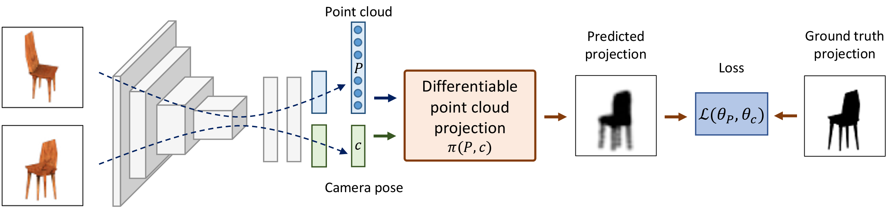

# Unsupervised Learning of Shape and Pose with Differentiable Point Clouds

Pytorch implementation of the tensorflow [codebase](https://github.com/eldar/differentiable-point-clouds/): 

## Setup

### Install dependencies
The code is in Python 3.6 and Torch >= 1.0. For supporting tensorboard, follow Torch >=1.4 is required.
Install basic dependencies:

```bash
conda install numpy scikit-image pillow scipy scikit-learn pyyaml
pip install easydict
conda install -c open3d-admin open3d
pip install tb-nightly
```
Install blender from official repo and create a soft link in external folder
```
ln -s /path/to/blender-2.79b external/blender
```

### Prepare training data
This follows Eldar's codebase but the files are saved as Pickle files. So, they take a bit more space than TF records. Viewpoints are saved offline.

Chair: 03001627
Car: 02958343
Airplane: 02691156

```bash
cd data
./download_train_data.sh 03001627
./create_tf_records_to.sh 03001627
./download_ground_truth.sh 03001627
```
### Train and Evaluate

<p align="center">
    
</p>

To train and evaluate the full model without camera pose supervision execute the following:

```bash
cd experiments/chair_unsupervised
# train and compute accuracy on the validation set
python ../../dpc/run/train_eval.py
# compute accuracy on the test set
python ../../dpc/run/predict_eval.py --eval_split=test
```

You can use a `--gpu` flag to specify an ID of the GPU you want to run on.

The file `chamfer_pred_test.txt` contains the accuracy of 3D shape reconstruction represented by the two quantities: coverage and precision. Chamfer distance metric is the sum of precision and coverage. More details on the evaluation metric can be found in the [paper](https://arxiv.org/pdf/1810.09381.pdf#section.5). 

The file `pose_error_pred_test.txt` contains camera pose estimation error. The first quantity is accuracy at the 30° threshold and the second one is the median error in degrees.

A configuration file to train a model with camera pose supervision is located in `experiments/chair_camera_supervision`.


### Visualise

We provide a Jupyter notebook to visualise predicted shapes. The rendering code uses Blender, which you can install in the `external/` subdirectory under name `blender` or simply create a symlink, for example:

```bash
ln -s /path/to/blender-2.79b external/blender
```

After, you can lunch the notebook `experiments/visualise.ipynb`.



## Citation
Please cite the original paper and (maybe) this codebase if it's helpful

```
@inproceedings{insafutdinov18pointclouds,
title = {Unsupervised Learning of Shape and Pose with Differentiable Point Clouds},
author = {Insafutdinov, Eldar and Dosovitskiy, Alexey},
booktitle = {Advances in Neural Information Processing Systems (NeurIPS)},
year = {2018}
}
```
