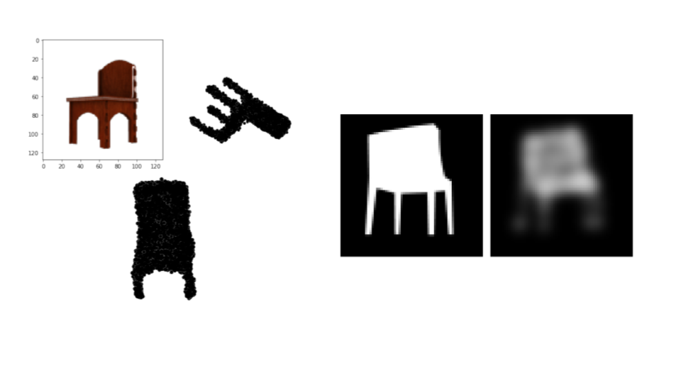

# Pytorch Implementation of Unsupervised Learning of Shape and Pose with Differentiable Point Clouds

Original tensorflow codebase [here](https://github.com/eldar/differentiable-point-clouds/)

## Setup

### Install dependencies
The code is in Python 3.6 and requires Torch >= 1.0. For supporting tensorboard, Torch >=1.4 is required.
Install basic dependencies:

```bash
conda install numpy scikit-image pillow scipy scikit-learn pyyaml
pip install easydict
conda install -c open3d-admin open3d
pip install tb-nightly
```
Install blender from official repo and create a soft link in external folder
```
ln -s /path/to/blender-2.79b external/blender
```

### Prepare training data
This follows Eldar's codebase but the files are saved as Pickle files. So, they take a bit more space than TF records. Viewpoints are saved offline.

Chair: 03001627
Car: 02958343
Airplane: 02691156

```bash
cd data
./download_train_data.sh 03001627
./create_tf_records_to.sh 03001627
./download_ground_truth.sh 03001627
```
### Train and Evaluate

<p align="center">
    
</p>

To train and evaluate the full model without camera pose supervision execute the following:

```bash
cd experiments/chair_unsupervised
# train and compute accuracy on the validation set
python ../../dpc/run/train_eval_to.py
# compute accuracy on the test set
python ../../dpc/run/predict_eval_to.py --eval_split=test
```

### Evaluation Results

| Model | Paper(128^3) | Paper(64^3) | Our Implementation (64^3)|
---|---|---|---
| Chairs Unsupervised| 3.62 |4.15 | **3.58**|
| Airplane Unsupervised| **2.84** |3.50 | 3.06|

Note that our results are obtained using image resolution of 128^2 and voxel resolution 64^3, trained for 100000 iterations and paper's results are for a voxel resolution of 128^3 trained for 600000 iterations.


### Visualise

Visualization code can be found in notebook `experiments/chair_unsupervised/visualise.ipynb`.


## Citation
Please cite the original paper and (maybe) this codebase if it's helpful

```
@inproceedings{insafutdinov18pointclouds,
title = {Unsupervised Learning of Shape and Pose with Differentiable Point Clouds},
author = {Insafutdinov, Eldar and Dosovitskiy, Alexey},
booktitle = {Advances in Neural Information Processing Systems (NeurIPS)},
year = {2018}
}
```
